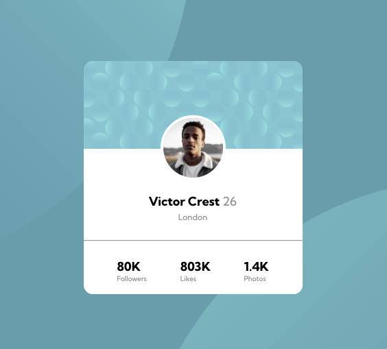

# Profile card component
Desafio profile card component do site Frontend Mentor/Dev Quest.
Com objetivo principal de criar um cartão que contém as informações de perfil. Trabalhando habilidades de posicionamento de elementos utilizando o flexbox. 📦

## Tecnologias utlizadas
- HTML
- CSS

## Dificuldades no projeto
- Saber quando criar uma div e como posicionar usando o flexbox.
- Usar bons nomes para as classes.
- Organizar e estilar as classes no css.

